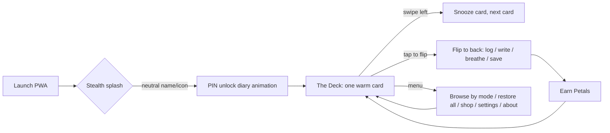

# The Garden — Implementation Plan

A calm, installable PWA companion for Australian mums navigating coercive control, parental alienation and the family law system. Built from the feeling of the support-group conversation: *being good all the way through matters; the love ledger is evidence you never stopped being their mum; healing is part of staying in the fight.*

This document is written to be handed to an AI coding agent (or a human builder) to implement end-to-end and deploy to GitHub Pages.

---

## 1. Intent & emotional brief

The app is **a daily companion for the quiet, consistent love that holds**. It is *not* a bingo card with reminders tacked on — the bingo was the seed, this is the garden.

Three emotional through-lines, drawn directly from the conversation, must shape every screen:

1. **"Being good all the way through does matter."** The app reinforces identity: *I'm the kind of mum who shows up consistently.* The accumulating ledger is evidence of that identity. On hard days, you read it back.
2. **A felt, embodied sense of safety.** Calm, never demanding. Repair-and-apologise messaging over perfection. No streaks that shame.
3. **Solidarity as survival.** The "support group nod," the "me too." Group wisdom (principles shared in the support group and by family-separation practitioners) lives in the app as short readable cards.

The app must feel like **opening a locked diary in a quiet room** — not like opening a productivity tool or a social feed.

---

## 2. Product principles (non-negotiable)

Grounded in Calm Technology (Amber Case / Calm Tech Institute), BJ Fogg behavior design, identity-based habits, self-determination theory, and humane/"time well spent" tech.

- **Minimum attention.** The app is a pass-through, never a demand. One warm card at a time.
- **Inform without speaking.** Gentle, ambient, periphery-first. Companions drift; they do not interrupt.
- **Still works when it fails.** Fully offline. No signal required for any core flow.
- **Safety is a feature, not a nicety.** For women whose exes have called police and child-safety on them, privacy = physical safety.
- **No extraction.** No analytics, no telemetry, no engagement-maximising loops. Retention comes from real value (your own words, read back).
- **Never shame.** No hard streaks. Missed days are invisible. The ledger only grows.
- **Tiny acts.** Every action fits in under 60 seconds. Frictionless logging.
- **Minimum tech needed.** Vanilla stack, tiny bundle, no backend.

---

## 3. Confirmed decisions


| Decision                 | Choice                                                                                                                                                                                                                                 |
| ------------------------ | -------------------------------------------------------------------------------------------------------------------------------------------------------------------------------------------------------------------------------------- |
| Core purpose             | The Whole Garden — all modes behind one calm home surface                                                                                                                                                                              |
| Daily engagement         | Three soft anchors — morning intention + evening "log one thing" + weekly letter-to-child nudge (all opt-in, off by default)                                                                                                           |
| Primary surface          | A calm, swipeable **card deck** (School-of-Life style) — one card at a time                                                                                                                                                            |
| Modes (card sources)     | Log · Write · Memory · Breathe · BIFF · Affirm · Wisdom · Bingo · Pleasures · Grounding                                                                                                                                                                        |
| Card interactions        | Scroll gently; swipe left = "not now" (snooze); **tap to flip** the card front→back (front invites, back acts); "bring them all back" restores dismissed cards                                                                                                               |
| Storage                  | IndexedDB (local only) + manual export/import (JSON file). No backend, ever.                                                                                                                                                           |
| Safety                   | Stealth mode (discreet name/icon + neutral splash) + PIN-locked diary opening with gentle animation. No quick-exit, no decoy.                                                                                                          |
| Gamification             | Earn **Petals** for in-app + logged real-life acts; spend in a **versioned shop** on palettes, wallpapers, and encouraging companion creatures. Inventory persists across app updates.                                                 |
| AI-assisted writing      | Opt-in hybrid AI (Puter.js default + BYOK Gemini/Groq) for BIFF replies from an ex's email and weekly letters to an alienated child (an established family-separation letter-writing structure). Lazy-loaded, off by default, the only feature that touches the network. |
| Tech stack               | Vanilla HTML/CSS/JS + service worker. Zero build step.                                                                                                                                                                                 |
| Visual identity          | User-selectable calm palettes + light/dark toggle. Soul matches the existing bingo cards (Cormorant Garamond + Outfit, soft glows).                                                                                                    |
| App name (internal)      | **The Garden**                                                                                                                                                                                                                         |
| Stealth/home-screen name | **Notes** (leaf icon) — adjustable                                                                                                                                                                                                     |
| Hosting                  | GitHub Pages, public repo under `codersasha`, free                                                                                                                                                                                     |


---

## 4. Information architecture

The home screen **is** the card deck. There is no grid of mode-buttons to confront the user. Modes exist only as *sources* of cards and as optional "browse" filters.




### Card types (each is a small, complete act)


| Card               | Source mode         | What it does                                                                                                                                                                                |
| ------------------ | ------------------- | ------------------------------------------------------------------------------------------------------------------------------------------------------------------------------------------- |
| **Victory prompt** | Log                 | "Did you do one of these today?" quick-tap presets (from the Love Ledger squares) + free text → logs to ledger                                                                              |
| **Letter nudge**   | Write               | "Write a few lines to [child] for when they're ready" → established 4-part letter scaffold + optional AI "help me start" (see §7), saved & dated                                                 |
| **Memory keeper**  | Memory              | "Something only you would know about [child] today" → quick text entry, dated                                                                                                               |
| **Breath**         | Breathe             | A 60–120s guided breath (animated circle, optional soft tone) → tap to start                                                                                                                |
| **BIFF helper**    | BIFF                | "Got a hostile email? Here's a calm way to reply" → manual template + before-you-send checklist, OR opt-in AI: paste → trauma-friendly digest → your feelings → style → BIFF draft (see §7) |
| **Affirmation**    | Affirm              | A reaffirming line (curated + user's own) → can save to "read on hard days"                                                                                                                 |
| **Wisdom**         | Wisdom              | A short principle card (the group's / practitioners') → read, reflect, save                                                                                                             |
| **Bingo pull**     | Bingo               | A square pulled from the existing validation or Love Ledger decks → tap to mark                                                                                                             |
| **Small pleasure** | Pleasures           | A gentle picture of something nice; flip to reveal "Small pleasures" + what it is. A tiny, image-only pause — no task, no ask. A soft "I noticed this" tap awards Petals and quietly moves on. |
| **Grounding link** | Grounding           | "Something to look at / listen to." Flip to a curated free, no-signup link or live stream (calm videos, ambient sounds, live cams, background news). Tap "Open" to leave the app for a moment of grounding — still works a week later. |
| **Check-in**       | (router)            | "How's your heart today?" → gently weights which cards surface next                                                                                                                         |
| **Crisis**         | (always accessible) | One tap to Parents Beyond Breakup helpline (1300 853 437) / 1800RESPECT / Lifeline / Legal Aid / FCFCOA / DV Connect. **Cannot be swiped away dismissively** — sits in a persistent, gentle footer.                                          |


### Deck mechanics

- **Shuffle on open.** Each launch reshuffles a fresh deck (the homepage changes every time you open it — positive variable reward, meaning not novelty).
- **Time-of-day weighting.** Morning → affirmations, breath, intentions. Evening → victory log, letter, memory.
- **Mood weighting (optional).** If the user does a check-in, low mood surfaces more breath + affirmation + "read back an old entry" cards, fewer task cards.
- **Snooze.** Swiped-left cards return after a cooldown (same session: after the deck cycles; next session: reshuffled back in).
- **Restore all.** A "bring them all back" action in the menu resets the snooze state instantly.
- **Per-mode browse.** A secondary, calmer list view to see all cards of one mode (e.g. all wisdom cards) — for when the user wants depth, not a shuffle.

### Flip card design (front → back)

Every card has two faces; **tapping flips it** (~500ms soft 3D turn, calm easing, no bounce). The front invites; the back acts. The flip is a gentle reward for curiosity — the user chooses when to go deeper, and can always flip back to the front or swipe left to snooze, from either face. The reveal itself is a small, warm payoff, and it keeps the deck calm (one face at a time, never a wall of options).

| Card | Front (invitation) | Back (action) |
|---|---|---|
| Victory prompt | "Did you do one of these today?" | Quick-tap presets + free text → log |
| Letter nudge | "A few lines for [child]" | 4-part letter scaffold + writing surface |
| Memory keeper | "Something only you would know about [child] today" | Quick text entry, dated |
| Breath | "Take a breath" + a soft still visual | The guided breath engine (tap to start) |
| BIFF helper | "Got a hostile email?" | Paste → digest → feelings → style → draft |
| Affirmation | The affirmation line | "Save to read on hard days" + a short reflection |
| Wisdom | The principle title | The fuller body + reflect/save |
| Bingo pull | The bingo square text | "Mark this" + context |
| Small pleasure | The picture (a calm line-art image) | "Small pleasures" + the name of the thing (e.g. "the sky at sunset") + a soft "I noticed this" tap |
| Grounding link | A soft still + "Something to look at / listen to" | The link title + a one-line "why" + an "Open" button (new tab) |
| Check-in | "How's your heart today?" | Mood selector (routes the deck) |
| Crisis | (persistent footer — not a flip card) | One tap to resources |

Swipe-left (snooze) and restore-all work from either face.

---

## 5. Core flows

### 5.1 Opening the locked diary

1. User taps the home-screen icon. Stealth name (**Notes**) and a generic leaf icon show in the OS.
2. A **neutral splash** (plain "Notes" wordmark, calm neutral background) appears — safe if someone glances.
3. The cover transitions to **The Garden's diary cover** (user-selected palette, serif title, a soft keyhole or ribbon motif).
4. A **PIN pad** slides up with a gentle animation (soft haptic on each digit, calm easing). Biometric (FaceID/Touch) offered where available.
5. On correct PIN, the cover **opens like a diary** (a page-turn / breath-in animation) and the deck breathes into view.
6. Wrong PIN: no error buzz — a soft "try again" shimmer. After 5 wrong attempts, a configurable cooldown (off by default; on if user enables in settings).

### 5.2 The two daily anchors (opt-in)

- **Morning intention** (default 7:30, user-set): a gentle notification — *"A new card is waiting in the garden."* Tapping opens to a morning-weighted card.
- **Evening log** (default 20:30, user-set): *"Log one quiet victory today."* Tapping opens straight to a Victory prompt card.
- **Weekly letter** (default Sunday 09:00, user-set day/time): *"It's Sunday — a few lines to [child] keep the thread active."* Tapping opens the Letter nudge with an established 4-part letter scaffold. Per established practice: do not fall silent; keep the thread alive.
- **Off by default.** The first-run flow invites the user to turn them on and pick times. Never naggy. Dismissible. Respect Do Not Disturb.
- Notifications are scheduled locally via the service worker / `Notification` API + `showNotification`. No push server (no backend).

### 5.3 Engaging with a card — the flip

- Each card is a **flip card**: the front shows a gentle invitation (a question, an affirmation, a title); **tapping flips it** with a soft ~500ms 3D turn to reveal the back, which holds the action (the log presets, the writing surface, the breath, the BIFF flow, the save button).
- The flip is the first small reward — it honours curiosity without demanding commitment. The user can flip back to re-read, or swipe left to snooze, from either face.
- On completion (log saved, letter saved, breath finished, BIFF copied, affirmation saved), award **Petals** with a soft sparkle animation.
- The card is marked done and gently leaves the deck.

### 5.4 Logging a quiet victory (the heart of the app)

- Quick-tap **presets** drawn from the Love Ledger squares ("Wrote a letter," "Didn't rise to the bait," "Went for a walk when grief hit hard," etc.) — tap one to log instantly.
- Optional **free-text** note.
- Optional **tag**: For your kids / For yourself / For each other.
- Each entry is **dated** and appended to the **Ledger**.
- The Ledger is reachable from the menu: a calm, scrollable timeline of everything logged. "On hard days, read it back" is the standing invitation.

### 5.5 The shop & companions

See §6.

---

## 6. Gamification & shop system

### 6.1 Currency: **Petals**

- Soft, non-monetary, on-theme (The Garden).
- Earned by:
  - **In-app acts:** logging a victory (+5), writing a letter (+10), finishing a breath (+3), saving an affirmation (+2), completing a BIFF reply (+8), a memory-keeper entry (+4), lingering on a small pleasure (+2), opening a grounding link (+2).
  - **Logged real-life acts:** the user can log a real-world good act ("made myself a proper meal," "attended handover when every part of me wanted to hide," "checked in on another mum") via a dedicated **"Log a real-life act"** entry — these are the *same* as victory presets but framed as the earning engine. +5 each, once per act per day.
- **No negative balances. No decay. No losing petals.** Earning only goes up.
- Petal balance shown as a small, calm counter in the header (a tiny flower icon + number). Never the focus.

### 6.2 The Shop

A **versioned catalogue** that ships with the app. New items are added by updating the GitHub Pages site (bumping the catalogue version). **Inventory persists in IndexedDB** and survives updates.

**Shop categories:**

1. **Palettes** — new calm colour themes (e.g. "Dusk Plum," "Morning Mist," "Eucalyptus," "Lantern Gold").
2. **Wallpapers** — gentle backgrounds for the diary cover / home (gradients, soft botanical line art, a lighthouse at dusk (a steady-light metaphor for being a constant presence)).
3. **Companions** — cute cats, dogs, birds, butterflies that drift across the screen in the periphery and occasionally offer a short validating/encouraging line. Each companion has a personality (the quiet cat, the hopeful sparrow, the steady tortoise, etc.).

**Item data shape (catalogue, shipped in app bundle):**

```json
{
  "id": "compassion-cat",
  "version": 3,
  "type": "companion",
  "name": "Marlowe",
  "species": "cat",
  "cost": 40,
  "isNew": true,
  "artRef": "assets/companions/marlowe.svg",
  "lines": ["you showed up today, that's the whole thing", "rest is also work"],
  "personality": "quiet"
}
```

**Inventory data shape (local, IndexedDB):**

```json
{ "ownedItemIds": ["eucalyptus-palette", "marlowe"], "equipped": { "palette": "eucalyptus-palette", "wallpaper": "lighthouse-dusk", "companion": "marlowe" }, "petals": 120 }
```

**Versioning rule:** the catalogue is keyed by stable `id`. Existing owned items remain owned even if their `cost` or `version` changes in a later release. Items with `isNew: true` show a soft "new" ribbon for ~14 days from their catalogue `addedAt` timestamp.

### 6.3 Companions (calm-tech behaviour)

- Companions **live in the periphery** — they drift slowly across the screen, occasionally settle, occasionally emit a single soft line in a small speech bubble, then drift on.
- They are **ambient, not interactive** by default. Tapping one gives a gentle reaction (a purr, a chirp, a wiggle) and one validating line.
- **Toggle / pause** in settings: "Companions: on / off / appear only on the diary cover." Respects the calm-tech periphery principle — users who find them distracting can mute them entirely.
- Their validating lines are seeded from the conversation's emotional through-lines (see §13) so they reinforce, not distract.

---

## 7. AI-assisted writing (BIFF replies & letters to your child)

Two opt-in AI features that address a real trauma block: when an email lands from the ex and you can't read or write through the fog, the app carries some of the cognitive load. **Off by default. Lazy-loaded. The only feature that touches the network.**

### 7.1 Why AI, and the privacy trade-off

Getting a hostile email commonly freezes the response system — trauma interferes with reading and writing exactly when a strategic, defensible reply matters most. A calm AI pass can (a) digest the email into plain, less-activating language, (b) surface what's actually being asked/proposed, and (c) draft a BIFF reply from the user's own feelings. The same engine helps write weekly letters to an alienated child using an established family-separation letter-writing structure.

**This is the one place data leaves the device.** Every other feature is local. So:

- Strictly **opt-in**, off by default. First use shows a calm consent screen: *"This uses an AI service. Your ex's email will leave your device to be analysed. You can stop here and use the manual BIFF helper instead."*
- The AI script is **lazy-loaded only on first invoke** — the base app stays fully offline and external-call-free.
- Pasted emails and drafts are **not stored** unless the user explicitly saves a draft/letter locally.

### 7.2 AI provider approach: hybrid

- **Default: Puter.js** — `<script src="https://js.puter.com/v2/">` loaded on demand, no API keys, no backend, no developer cost. 400+ models (Gemini Flash, GPT, Claude, Grok, Llama). The *end user* signs into their own Puter account once; new accounts get free credits, so most users pay nothing. Puter is privacy-focused (no tracking, no personal-data monetisation).
- **Optional: Bring-your-own-key (BYOK)** — in Settings, an "Advanced" path to paste a Google Gemini or Groq API key (both have genuinely-free tiers). Stored locally in `ai_settings`. No Puter account needed.
- **Fallback: manual** — if the user declines AI, the manual BIFF template + the letter scaffold remain fully available (Wave 3 content).

**Model choice:** default to a cheap, fast, capable model (e.g. `google/gemini-3.5-flash` via Puter, or Gemini Flash via BYOK). Configurable in Settings.

### 7.3 Flow A — BIFF reply from an ex's email

1. **Paste.** User pastes the ex's email into a calm text area.
2. **Digest.** AI returns a trauma-friendly digest: a short, neutral summary of what's being said and what's actually being asked/proposed — minus the hostility, blame, and bait. Plain language. Less activating.
3. **Feelings.** The app asks, in the user's own words: *"How does this make you feel? What do you actually want to happen?"* — short free-text (voice input welcome).
4. **Style.** User picks a **style** (see §13.8): *Conditional agreement*, *Therapeutic-parent positioning*, *Strategic slowness*, or *Two-audience* (generates both a factual version for the "family app"/other parent and a warm version for the child).
5. **Draft.** AI returns a BIFF draft (Brief, Informative, Friendly, Firm) in the chosen style, incorporating the user's feelings/aims, never adopting the ex's hostility, always reading as the reasonable, child-focused parent.
6. **Review + guardrails.** The draft is shown with the **before-you-send checklist** (brief? firm without being hostile? evidence-friendly — does it show *you* as the reasonable one? no over-explaining? no taking the bait?). User edits freely.
7. **Save / copy.** Copy to clipboard, or save the draft to `biff_drafts` locally. Award Petals.

**Prompt design:** the system prompt enforces BIFF, Australian English, child-focused framing, no legal advice, no diagnoses of the ex, and includes the style few-shot examples from §13.8. Hard instruction: never escalate, never match the ex's tone, always leave the user as the calm party on the record.

### 7.4 Flow B — Letter to your alienated child (established family-separation practice)

1. **Cadence nudge.** A third anchor (weekly, same day/time the user picks) gently surfaces a **Letter nudge** card: *"It's Sunday — a few lines to [child] keep the thread active."* (Per established practice: do not fall silent; the letter keeps you alive in the child's inter-psychic world even when read through disdain.)
2. **Scaffold.** The writing surface offers the 4-part structure as gentle prompts (see §13.9): unconditional love + acknowledge distance → brief neutral updates about your life → a specific past memory or future hope → firm, loving reminder of the permanence of the relationship.
3. **AI assist (optional).** "Help me start" invokes the AI with the child's name, a few facts/memories the user has stored (from the Memory keeper — only if `childFactsOptIn`), and the structure + tone guardrails. Returns a short, warm draft the user edits. Reinforces: *"Adapt this to your child — don't send as-is."*
4. **Tone guardrails.** Brief, loving, not seeking a reply, neutral life updates, no blame toward the other parent, no interrogating the child, no asking for a response.
5. **Save & date.** Saved to `letters` (sealed, dated) — the ledger of love. Optionally attach a photo/memory token (visceral impact, per established practice). Award Petals.
6. **Expect-and-ignore reminder.** A gentle wisdom line after saving: *"If you get a negative reaction, that's the defensive part — it means the letter reached the real part. Wait, then write again."*

### 7.5 AI settings store

```json
{
  "aiEnabled": true,
  "provider": "puter",
  "byokProvider": "gemini",
  "byokKey": "<encrypted>",
  "model": "google/gemini-3.5-flash",
  "consentSeen": true,
  "childFactsOptIn": false
}
```

### 7.6 Safety rails on the AI

- **No legal advice. No diagnoses.** No statements about the ex that could backfire as evidence.
- **Child-content opt-in.** Using stored memories as letter context requires an explicit toggle; off by default.
- **Never auto-send.** Drafts are never emailed or transmitted; the app has no email integration.
- **Graceful failure.** If the AI call fails or is offline, fall back to the manual templates with a calm message.
- **No telemetry from us.** Whatever the provider logs is governed by the user's own Puter/key relationship — the app adds nothing of its own.

---

## 8. Content model & data shapes

### 8.1 Card descriptor (in-app content, shipped)

```json
{
  "id": "wisdom-felt-safety",
  "type": "wisdom",
  "mode": "Wisdom",
  "title": "Felt safety",
  "body": "Kids see what's underneath. Being consistently loving despite your own discomfort gives them a felt sense of safety they can't explain — and it's what they need to be whole.",
  "attribution": "— a wisdom from the group",
  "timeHint": "any",
  "tags": ["for-your-kids"]
}
```

Card types: `victory-prompt`, `letter-nudge`, `memory`, `breath`, `biff`, `affirmation`, `wisdom`, `bingo-pull`, `small-pleasure`, `grounding-link`, `check-in`.

### 8.2 User data (IndexedDB stores)

- `ledger` — victory entries `{ id, date, preset?, note?, tag?, petals }`
- `letters` — letters to child `{ id, date, childName?, body, sealed: true }`
- `memories` — memory-keeper entries `{ id, date, body }`
- `affirmations_saved` — saved affirmations `{ id, date, text }`
- `real_life_acts` — logged real-life acts `{ id, date, label }`
- `settings` — `{ pinHash, stealth, palette, wallpaper, companion, companionMode, notifications: {morning, evening, on}, childName, themeMode, ... }`
- `ai_settings` — `{ aiEnabled, provider, byokProvider?, byokKey?, model, consentSeen, childFactsOptIn }` (see §7.5)
- `biff_drafts` — saved BIFF drafts `{ id, date, style, exEmailDigest?, draft, saved }`
- `inventory` — `{ ownedItemIds[], equipped{}, petals }`
- `deck_state` — `{ snoozedIds[], doneToday[] }`

### 8.3 PIN storage

- **Never store the raw PIN.** Store a salted hash (Web Crypto `SubtleCrypto.deriveBits` with PBKDF2 + a random salt). The PIN unlock compares hashes. (Even though data is local, this prevents casual shoulder-surfing recovery of the PIN from a file.)

---

## 9. Data & storage

- **IndexedDB** via a tiny wrapper (no library, or `idb-keyval`-sized ~1KB helper). Chosen over localStorage for structured data, larger capacity (letters over time), and offline-friendly transactions.
- **No backend. No accounts. No cloud sync by default.**
- **Export / Import** (the safety valve for "lose phone = lose ledger"):
  - **Export:** "Download my garden" → produces a `garden-backup-YYYY-MM-DD.json` file containing all stores + inventory + settings (PIN hash excluded by default; optional "include PIN hash" off). The user is guided to save it to their own cloud drive (iCloud / Google Drive) or email it to themselves.
  - **Import:** "Restore my garden" → file pick → merge/replace with confirmation. Warns it will overwrite.
  - Recommended cadence: a gentle, dismissible monthly reminder to export a backup.
- **Privacy promise** stated plainly in settings and first-run: *Nothing leaves your device unless you choose to export. No analytics. No accounts.*

### 9.1 Extensibility & backwards compatibility (updates never break an install)

The app updates by pushing to `main` (GitHub Pages). Every user's local save data must survive every update, indefinitely. This is a hard requirement, not a nicety — corrupting a mother's love ledger is unacceptable.

- **Schema-versioned stores.** Every record carries a `schemaVersion` (integer). A `migrations.js` module runs idempotent, ordered upgrade functions on app load, walking each stored record from its saved version up to the current version. New fields get safe defaults; old fields are tolerated (never read in ways that assume their absence).
- **Additive-only content.** Cards, affirmations, wisdom, BIFF styles, catalogue items, and palettes are identified by **stable string `id`s** and added by appending to the content files — never by array index. Removing/renaming an `id` is forbidden; deprecate instead (flag `deprecated: true`, stop surfacing). This means shipped content updates never deserialise a user's saved state.
- **Catalogue inventory is merge-by-id.** The user's `ownedItemIds` and `equipped` are intersected against the current catalogue on load; owned items that no longer exist in the catalogue are kept (still equippable) but hidden from the shop list. New catalogue items appear with a "new" ribbon; existing inventory is never wiped.
- **Settings are forward-tolerant.** Unknown future settings keys are preserved untouched; missing keys are filled with defaults on read. No "wipe settings on version bump" — ever.
- **Export format is versioned too.** The backup JSON carries a `formatVersion`; import runs the same migration path so an old backup restores cleanly into a newer app, and a newer backup into an older app degrades gracefully (unknown fields ignored, not crashed).
- **Feature flags** in `settings` gate new features on/off so an old install can receive an update without a half-built feature surfacing.
- **Architecture for growth.** Vanilla but modular: a tiny app shell + a simple state/event bus + one module per concern (`db`, `deck`, `cards`, `ledger`, `breathe`, `biff`, `ai`, `shop`, `companions`, `theme`, `notify`, `migrations`). New modes are added as new card types in `cards.js` + a content file — no core rewrite. New future-possibility features (sync, future-self letters, companion moods, printed export) each land as a new module behind a feature flag.
- **No breaking changes without a migration.** Any change to a store's shape MUST ship with a migration in the same release. This is a review gate, not a guideline.

### 9.2 Local development & testing (yes — you can just open `index.html`)

A priority: the app must run by double-clicking `index.html` (the `file://` origin) — no server, no install — so anyone can test locally in seconds.

To make that true, the architecture makes two deliberate choices:
- **Classic scripts, not ES modules.** Use `<script src="js/app.js"></script>` (plain `<script>`), not `<script type="module">`. ES modules are blocked on `file://` by CORS; classic scripts work everywhere. Modules communicate via a small global namespace / event bus.
- **Content as JS globals, not fetched JSON.** Seed content lives in `/js/content/*.js` files that assign to global arrays/objects (e.g. `window.GardenContent.affirmations = [...]`), exactly like the existing bingo's `const SQUARES = [...]`. `fetch()` of local JSON is blocked on `file://` in Chrome, so we avoid it for bundled content.

What works on `file://`: the deck, flip cards, logging, the Ledger, letters, memories, breathing, BIFF manual templates, affirmations, wisdom, bingo, theming, companions, shop, PIN unlock, and export/import. What does **not** work on `file://`, and needs a local static server to test:
- **Service worker** (offline cache, install prompt, notifications) — service workers only register on `http(s)`. The app detects `file://` and gracefully skips SW registration with a calm dev notice.
- **IndexedDB** is unreliable on `file://` in some browsers (Firefox blocks it; Chrome allows it but scoped oddly). The `db.js` wrapper detects failure and falls back to `localStorage` so the app still works for a quick test. **For real persistence testing, run a local server.**
- **AI features** (Puter.js / BYOK) are best tested under `http://` — cross-origin `fetch` from a `file://` origin can be blocked by CORS.

**To run a local server (one command):** `python3 -m http.server` (then open `http://localhost:8000`) or `npx serve`. Use this for PWA/persistence/AI testing. Use plain `file://` for a fast content/UX sanity check.

---

## 10. Privacy & safety

- **No account required.** Works fully offline, local-only, no email, no identity.
- **Stealth mode (default on):**
  - Home-screen app name: **Notes** (adjustable).
  - App icon: a generic leaf / notebook icon (maskable PWA icon).
  - Splash: plain neutral "Notes" wordmark — does not reveal real content on a glance.
  - Inside, after PIN unlock, the real identity (**The Garden**) shows.
- **PIN / biometric lock** to open — the "locked diary" feel (§5.1).
- **No external analytics, no telemetry, no third-party fonts loading at runtime after first cache** (self-host the two font families to eliminate any external call). **The sole intentional external call is the opt-in AI feature (see §7)** — lazy-loaded only on first invoke, with a clear consent screen. With AI off, the app makes zero external network calls.
- **Crisis resources always one tap away** — a persistent gentle footer link, present on every screen, that opens the resource list. Cannot be dismissed.
- **What we deliberately did NOT add:** quick-exit button and decoy mode (per your call). The PIN + stealth cover the main risk; the splash is the glance-protection.

---

## 11. PWA setup

- `manifest.webmanifest`: name "Notes" (stealth), `short_name` "Notes", `display: standalone`, `theme_color` / `background_color` set to the neutral stealth palette, `icons` (192, 512, maskable), `start_url: "/"`, `scope: "/"`, `orientation: portrait`.
  - Note: the manifest name is the stealth name; the in-app real name ("The Garden") appears only post-unlock.
- `service-worker.js`:
  - Precache the app shell (HTML, CSS, JS, fonts, icons, companion SVGs, catalogue). **Do NOT precache the Puter.js script** — it is loaded on demand only when the user invokes AI, so the base app stays offline-first and external-call-free.
  - Runtime cache for any assets.
  - `Notification` handling for the two daily anchors (scheduled via `setTimeout`/alarms while the app is open, plus a `sync`-style local scheduler). iOS Safari PWA notification support is limited; document this and fall back to "open the app at your chosen time" with a calm in-app reminder banner if notifications are unavailable.
- **Offline-first:** all content lives locally; the app is fully functional with no signal.
- **Install prompt:** a gentle, in-app "Add to Home Screen" nudge on second open (not aggressive); explains it makes the diary feel like a real app and works offline.

---

## 12. Visual identity & theming

- **Type:** Cormorant Garamond (serif headings, the diary feel) + Outfit (UI text). Match the existing cards for continuity. Self-host for offline + privacy.
- **Default palettes** (ship 3–4, more in shop):
  - **Dusk Plum** (matches Mum Survivor Bingo) — deep purple, lilac accent, gold.
  - **Forest Teal** (matches Love Ledger) — deep teal, sage accent, rose.
  - **Morning Mist** — soft warm light mode, cream + dusty rose.
  - **Lantern Gold** — warm dark, amber glow (a steady-light motif).
- **Light / dark toggle** per palette, plus "follow system."
- **Motion language:** slow easings (cubic-bezier ~`0.22, 1, 0.36, 1`), 400–600ms, never bouncy. The diary open is a ~700ms page-turn. Card swipes follow the finger with light resistance. **The card flip is a ~500ms 3D Y-axis turn with the same easing; only one card flips at a time; reduced-motion mode replaces the turn with a calm cross-fade.** **Ambient softness throughout** gives the app a warm, grounded, living feel: cards breathe (a 6s subtle scale/opacity drift), the background palette drifts over ~30s, companions bob and wander, screen transitions fade (~250ms) rather than cut, the PIN dots ease in, and the Petal sparkle is a single soft bloom (never a burst). All ambient loops respect reduced-motion (stilled) and pause when the tab is hidden.
- **The locked-diary cover** is the emotional centrepiece: the selected palette, the diary title in Cormorant, a keyhole/ribbon motif, the user's child's name optionally etched as a faint watermark (their choice).

### 12.1 Soft soundscape (lo-fi ambient — off by default)

A gentle, optional ambient soundscape for warmth and grounding — a soft lo-fi pad with a slow minor-7th chord cycle, muted vinyl crackle, and a faint, slow beat. **Generated live with the Web Audio API** (no audio files, no licensing, no copyright risk, works offline, and never repeats exactly), so it's always free and never stale. The breath tones (§5) use the same engine.

- **Toggle:** off by default; a small sound icon in the header (or a "Soundscape" item in the menu) turns it on; persists in `settings.soundscape = { enabled, volume }`.
- **Behaviour:** 2s gentle fade in/out (no abrupt cuts); auto-softens when a guided breath is playing; auto-pauses when the tab/app is hidden (`visibilitychange`) and resumes on focus; volume slider only; never plays over a crisis-footer tap.
- **Reduced-motion / DND:** independent of reduced-motion (audio isn't motion), but stays off by default and is user-initiated only.
- **Future (additive):** an optional `/assets/audio` pack of CC0 short lo-fi loops (with an `ATTRIBUTION.txt`) for variety, behind the same toggle — not required for v1.

### 12.2 Accessibility & mobile-usability best practices (mobile-first, laptop-considerate)

The audience may be using this with shaky hands, in tears, in the dark, on a small phone, one-handed, while exhausted. The app must be calm *and* genuinely easy to use. These are the non-negotiable baseline; they're WCAG 2.2 AA-aligned with a few AAA best-practice bumps where the cost is trivial.

**Touch targets & spacing (the #1 mobile frustration killer)**
- Every interactive element: **≥ 44×44 CSS px** hit area (WCAG 2.5.5 AAA best practice; WCAG 2.5.8 AA minimum is 24×24 — we exceed it). Visual size can be smaller; expand the hit area with an invisible `::after`/padding (`@media (pointer: coarse)`) rather than bloating the visual.
- **Spacing between adjacent targets ≥ 8px**; navigation items ≥ 12px; ≥ 16px if either target is within ~80px of a screen edge (thumbs approach at an angle). Spacing reduces mistaps more than size once you're past ~40px.
- `touch-action: manipulation` on all interactive elements (kills the legacy 300ms tap delay and double-tap zoom).

**Thumb-zone placement (one-handed, shaky)**
- Primary actions live in the **bottom 40%** of the screen and are bottom-anchored (the deck's swipe/restore-all, the BIFF "copy", the Ledger "log"). The crisis footer sits here precisely because it must always be reachable.
- Avoid critical controls in the **top corners** (require a regrip). The header holds only low-frequency controls (soundscape toggle, menu) — never the main path.
- Cards: the **whole card is the tap target** for flip (not a tiny icon). Snooze is a deliberate edge-swipe, not a small button.

**Type & readability**
- **No hardcoded px font sizes.** Type scale in `rem` anchored on a root size that respects the user's browser/OS text-size setting; support **200% text resize without clipping or overlap** (WCAG 1.4.4). Flexible containers, wrapping, line-height ~1.5 for body.
- Base body text ≥ **16px** (1rem); card titles larger. Avoid long line lengths (> ~70 characters) — the single-card layout handles this naturally.
- Respect `prefers-reduced-motion` (stills all ambient loops, swaps flip for cross-fade — see §12) and `prefers-color-scheme` (auto light/dark unless the user has chosen a palette).

**Colour & contrast**
- **Body text ≥ 4.5:1** contrast against its background; large text (≥ 18.66px regular / ≥ 14px bold) and meaningful non-text UI (icons, card edges, focus rings) ≥ 3:1 (WCAG 1.4.3 / 1.4.11). Every shipped palette is contrast-verified at light and dark before it enters the catalogue.
- **Never colour alone** to convey state (saved/unsaved, equipped, "new" ribbon) — always pair with a label, icon, or shape, and honour the OS "Differentiate without color" / high-contrast preferences.
- Crisis resource links must remain high-contrast even inside the calmest, lowest-saturation palettes — calm never comes at the cost of legibility on the one screen that matters most.

**Layout, safe areas, reflow**
- `viewport-fit=cover` + `env(safe-area-inset-*)` padding so notches, dynamic islands, and the home indicator never cover the crisis footer or the bottom CTA. This is the single most common "looks fine in dev, broken on real phone" bug.
- **Reflow** (WCAG 1.4.10): content wraps rather than scrolling in two axes; no horizontal scroll at 320px width. Works in both portrait **and landscape** (1.3.4) — a lying-down-in-bed user in landscape is a real use case here.
- Single-card layout is inherently mobile-first and reflow-safe; the few list views (Ledger, shop, browse-by-mode) use full-width rows, not multi-column grids on mobile.

**Laptop / desktop consideration (secondary but real)**
- At `min-width: ~720px`, cap content width (~640–720px), centre it, and let the card deck keep its intimate scale — don't stretch a single card across a 1440px screen (feels cavernous and exposed). Use `@media (pointer: fine)` to drop the expanded hit-area `::after` and show hover affordances (subtle, never required).
- Full **keyboard navigation**: Tab order matches reading order, visible focus ring (≥ 3:1, 2px outline, never `outline: none` without a replacement), Enter/Space activate cards, arrow keys move the deck, Escape closes modals. Swipe actions have keyboard equivalents (← snooze, Enter flip). This is required for accessibility regardless of device.
- Test the whole app with keyboard only and with the browser zoomed to 200% on a laptop — both must still work.

**Friction & emotional ergonomics (the "feels good to use" layer)**
- **No surprise modals, no destructive single taps.** Destructive actions (wipe data, delete a draft) ask twice and use plain language ("Delete this letter? You can't get it back"), with the calm option pre-focused — never default-focus "Delete".
- **Redundant entry reduced** (WCAG 3.3.7): the PIN is entered once to unlock; the child's name is captured once and reused; letter scaffolds pre-fill the date.
- **Gentle haptics** (where available) on flip, on Petal earn, on PIN dot — optional, off-able, never harsh. No haptics on error (no "buzz of failure").
- **Errors are kind:** wrong PIN is a soft shimmer + "try again", never a red shake or a buzz. Empty states are warm ("Nothing here yet — that's okay. Your first entry will show up here.").
- **No dead ends.** Every screen has a calm way back; the deck always has a next card; the crisis footer is always one tap away from anywhere.
- **Load instantly.** Offline-first + the classic-script architecture means the shell is painted before any logic runs; a calm first frame (the diary cover) shows immediately, never a blank screen.

**Verification (added to Wave 6 acceptance)**
- Audit at the largest OS text size on a real phone: nothing clips, the crisis footer stays visible and reachable, the bottom CTA stays in the thumb zone.
- Keyboard-only + 200% browser-zoom pass on laptop.
- Contrast check every palette (light + dark) with an automated tool; zero AA failures.
- Tap every interactive element: every one is ≥ 44×44, no mistaps between adjacent controls.

---

## 13. Content seeds (from the conversation & existing cards)

Seed the app at launch with real content drawn from the conversation and the two existing bingo files. These are the soul.

### 13.1 Affirmations (Affirm mode)

- "You are not the villain in this story." *(already in the bingo footer)*
- "Being good all the way through does matter."
- "You're seen. You're not crazy. And you're still here." *(from the bingo win banner)*
- "The love never stopped." *(Love Ledger free space)*
- "They will come back to you. They just need the chance to be with you again without his influence."
- "What you do still matters."

### 13.2 Wisdom cards (Wisdom mode) — distilled from the support-group conversation and family-separation practice

- **Felt safety:** "Kids see what's underneath. Being consistently loving despite your own discomfort gives them a felt, embodied sense of safety. That's what makes them whole."
- **The cracks test:** "Kids 'test' the surface-level parent and the cracks show. They test us and there are no cracks — because we repair and apologise. The other parent usually won't, or gives a pseudo-apology."
- **Reclaiming your role:** "Pulling back isn't giving up. It's reclaiming your role. Stop trying to repair *their* relationship; focus on what you do together, and on teaching them what to expect from a parent."
- **Court optics + best interests:** "Decide with both eyes open: what's in your child's best interest *and* how the court will perceive it. It's a no-win situation — so act deliberately, and let everything you do be defensible."
- **BIFF + the pattern:** "Keep it sparing and targeted. Give options without being overinvolved. Courts look for patterns of behaviour; small, specific, proactive steps (a BIFF email noting something he cancelled) show you support the connection."
- **We can't give them the healthy part:** "We can't fix the other parent into who our child needs them to be. Send them back or don't — we still hurt for them. What we *can* give is the safety underneath."
- **Solidarity is survival:** "The nod in the support group, the resource shared, the message that says 'me too' — you're part of something bigger."

### 13.3 Victory presets (Log mode) — reuse the Love Ledger `SQUARES` array verbatim from `love-ledger.html`, plus a "Log a real-life act" entry path.

### 13.4 Bingo pulls (Bingo mode) — reuse both `SQUARES` arrays from `index.html` and `love-ledger.html`.

### 13.5 Crisis resources — reuse the resource list from `index.html` (1800RESPECT, Lifeline, Legal Aid, FCFCOA, DV Connect). Mark which are 24/7.

Add to that list (Australian, free, peer-based — the most on-target for this audience):

- **Parents Beyond Breakup helpline — 1300 853 437** (operates 365 days a year). PBB is an Australian suicide-prevention charity for separating mums, dads, and grandparents — one of Australia's most at-risk demographics. Free, confidential, peer-based, non-judgemental. **Top-listed** in the footer.
- **Mums in Distress (MIDs)** — `https://www.parentsbeyondbreakup.com/mids` — the mum-specific frontline program (remote + in-person peer support).
- **Separation checklist** — `https://www.parentsbeyondbreakup.com/get-support/separation-checklist` — a practical "get in order" list. Surface as a one-time "practical next steps" link in onboarding and under Help — **not** as a daily card (it's admin, not calm).
- **Free suicide-awareness training** — link from `https://www.parentsbeyondbreakup.com/` (free, ~30-min, self-paced, trauma-informed; instant certificate). For the user *and* the people supporting them; listed under Help, never pushed.

Other helpful PBB pages to fold in (verify URLs at release, additive `id`s): the `/get-support` hub, **Grandparents in Distress (GIDs)** for grandparent users, and the **Dads in Distress (DIDs)** program so the app can gently signpost non-mum users too. Label availability accurately — the PBB helpline is 365-days, not 24/7.

**Non-affiliation (carry into About + README):** The Garden is independent and not affiliated with Parents Beyond Breakup; these links are included because their free peer support is the most on-target Australian resource for this audience. No money changes hands.

### 13.6 BIFF helper content

- A short "What is BIFF?" explainer (Brief, Informative, Friendly, Firm).
- A fill-in template: *Observation → your position → what you'd like → close.* With calm tone guidance and a before-you-send checklist ("Is it brief? Is it firm without being hostile? Could this be used as evidence — does it show *you* as the reasonable one?").
- When AI is enabled (see §7), the user can paste the ex's email and pick a **style** (see §13.8) to generate a draft; the manual template remains the fallback.

### 13.7 Companion lines — short, validating, in the conversation's voice:

- "you showed up today. that's the whole thing."
- "rest is also work."
- "you're not crazy. I see it too."
- "one strong wind and the whole act is gone — but not you."
- "the love never stopped."

### 13.8 BIFF reply styles (few-shot examples for the AI)

These four styles are both UI selections and few-shot examples in the BIFF system prompt. The examples below are **synthetic**, written to demonstrate each pattern; the app ships synthetic examples like these — no real correspondence is stored.

1. **Conditional agreement** — cooperative but firm; creates a condition; slows it down; asks for *their* proposal.
  *Example:* "Dear X, thank you for letting me know you'd like to take the children away during the second week of July. I've checked the calendar and those days overlap with time they're due to be with me. I'm open to considering it, for the children's sake, if we can arrange replacement days so they don't lose that time with me. Please let me know what dates you'd propose as alternatives and I'll be in a position to consider it fully. Kind regards."
2. **Therapeutic-parent positioning** — models the engaged, reflective, child-focused parent; invites co-operation on the child's healing; reads well as evidence.
  *Example:* "Hi X, I've been thinking about how we can best support the children through this period, which I don't think is easy for them. I've been reading widely on therapeutic parenting and working with a counsellor to understand what they might be feeling underneath. I've attached a short piece I found genuinely helpful; I'd welcome your thoughts on whether any of it might be useful in how we support them. I'm always looking for the best way to help them feel settled. Kind regards."
3. **Strategic slowness** — a stance, not a template: slow it down, make them wait, don't reward a pushy email with an immediate full answer. The AI adopts a measured, unhurried cadence and asks one clarifying question rather than committing.
  *Example:* "Hi X, received your message — I need a little time to consider it properly and will come back to you by the end of the week. Could you confirm the dates you have in mind so I can check the calendar? Kind regards."
4. **Two-audience** — same event, two versions: a factual, neutral note to the other parent (the evidentiary version), and a warm, personal note to the child (the relationship version). The AI generates both, audience-appropriate.
  *To the other parent (factual):* "Hi X, noting your message about the holiday dates. I'll be away later this week and will respond fully when I'm back. Kind regards."
  *To the child (warm):* "Hi [child], just thinking of you and hoping you're okay. I saw a sunset the other night that looked just like the ones we used to watch from the kitchen window. Miss you. You know where I am whenever you want to chat. Love you always."

**Standing instruction to the AI across all styles:** BIFF always; Australian English; never match the ex's tone; never diagnose; never legal advice; always leave the user as the calm, child-focused party on the record.

### 13.9 Letter-to-child structure (scaffold + tone guardrails)

Drawn from established family-separation practice for parents in the rejected position. Ship as the letter scaffold and as the AI letter system prompt.

**Cadence:** weekly, same day/time. Don't fall silent — the very fact that you write keeps the thread alive in your child's inner world, even when the letter is read through disdain.

**4-part structure:**

1. **Unconditional love + acknowledge distance + hope for their wellbeing.** Address the authentic child, bypassing the defensive part.
2. **Brief, neutral updates about your life** — reassure them you're okay and stable. (Not a performance; just "I'm still here, and okay.")
3. **One specific past memory OR a future hope** — signal that life isn't permanently fixed; keep the door open without pressure.
4. **A firm, loving reminder of the permanence of the relationship** — regardless of current rejection.

**Synthetic example (adapt freely — never send as-is):**

> "[Child], I think of you every day and hope you're well. Things are quiet here — the garden's come back to life and I've been walking in the mornings. I still smile every time I pass the ice-cream shop near the old place; you'd laugh, they still have that ridiculous mint-choc-chip sign. None of that changes, and neither does how I feel about you. Whenever you're ready, I'm here. All my love, always."

**Tone guardrails (enforced in the prompt):**

- Keep it short. Not very much is said in words; much is said symbolically.
- Do **not** write for a response or validation — that keeps you seeking approval from the defensive part.
- No blame toward the other parent. No interrogating the child. No asking them to reply.
- Combine with a photo or small token where possible (visceral impact).
- **Never send a template as-is** — adapt to your child. The app surfaces this reminder every time.

**Expect-and-ignore reminder (shown after saving):** "A big negative reaction means the letter reached the real, split-off part — it's the defensive part reacting. Ignore the reaction, wait a while, then write again."

### 13.10 Small pleasures (Pleasures mode)

A tiny, image-only pause in the deck — no task, no ask. The front is a gentle line-art picture; the back reads "Small pleasures" and names the thing. The point is to train the eye back onto the small good things that grief and survival-mode crowd out. Each pleasure pairs with a small shipped **SVG illustration** (line-art, calm palette) — no external images, stays offline, no copyright risk. On the back, a soft "I noticed this" tap awards +2 Petals and quietly moves on; the moment can optionally be saved to the Ledger.

Seed list (synthetic; append freely, stable `id`s only — never rename or reuse an `id`, see §9.1):

- `sky-at-sunset` — "the sky at sunset"
- `small-baby` — "seeing a small baby"
- `empty-train-carriage` — "a long journey in an empty train carriage"
- `eating-a-fig` — "eating a fig"
- `first-sip-coffee` — "the first sip of coffee in a quiet house"
- `rain-on-window` — "rain on the window when you're already inside"
- `old-dog-sighing` — "an old dog sighing as it lies down"
- `smell-of-rain` — "the smell of rain on hot pavement"
- `forgotten-note` — "finding a forgotten note in a coat pocket"
- `stranger-baby-smile` — "a stranger's baby smiling at you in a queue"
- `warm-socks` — "warm socks from the dryer"
- `first-cool-evening` — "the first cool evening after a heatwave"
- `cat-purr` — "a cat's purr against your chest"
- `empty-beach-winter` — "an empty beach in winter"
- `peeling-tangerine` — "peeling a tangerine in one piece"
- `hot-water-cold-hands` — "hot water on cold hands"
- `streetlights-on` — "streetlights coming on one by one"
- `headache-lifting` — "the moment a headache lifts"
- `bookshop-smell` — "the smell of a bookshop"
- `childs-drawing` — "a child's drawing pinned to a fridge"

Data shape: `{ id, title, imageRef: "assets/pleasures/<id>.svg" }`.

### 13.11 Grounding links (Grounding mode)

Free, no-signup, no-setup links and live streams that help with grounding, calm, and feeling less alone — and still work when revisited a week later. Each card opens the link in a new tab (the only intentional external navigation besides the AI feature and the crisis footer). Curated, stable, re-verified each release; a dead link is **deprecated** (additive — see §9.1) and replaced with a new `id`, never silently deleted.

Seed list (synthetic; verify each before ship; swap AU-context ones if they break):

- `abc-news-24-live` — ABC News 24 live stream (YouTube). *Why:* "Put the news on in the background if it's too hard to watch directly — it eases the loneliness and gently pulls you out of your own bubble."
- `iss-live` — NASA International Space Station live cam (earth from orbit). *Why:* slow, silent, perspective-shifting.
- `lofi-beats-stream` — a long-running "lo-fi beats to relax/study to" live YouTube stream. *Why:* soft, steady company.
- `rainy-mood` — a one-tap rain soundscape. *Why:* instant ambient calm, no signup.
- `a-soft-murmur` — a free ambient mixer (rain, wind, fire, waves). *Why:* build your own calm; no signup.
- `mynoise` — a free soundscapes library (rain, singing bowls, drones). *Why:* deep grounding textures; no signup.
- `radio-garden` — tune into live radio from anywhere on Earth. *Why:* a window out of the bubble; feels less lonely.
- `drive-and-listen` — drive through a city with its ambient street sound + local radio. *Why:* gentle motion and company; no signup.
- `monterey-sea-otters` — Monterey Bay Aquarium's live sea-otter cam. *Why:* gentle, living, low demand.
- `monterey-jellies` — live jellyfish cam. *Why:* hypnotic and calming.
- `explore-org-nature-cams` — explore.org live nature cams (bears at a river, etc.). *Why:* free, no signup, quietly alive.
- `window-swap` — a random real window somewhere in the world with its sounds. *Why:* a small, foreign moment of company.
- `smithsonian-zoo-cams` — Smithsonian National Zoo live animal cams. *Why:* free, no signup, soft focus.
- `virtual-fireplace` — a long YouTube fireplace + crackle video. *Why:* warm, zero demand.

Each entry: `{ id, title, url, why, kind: "video" | "stream" | "site" | "cam" }`. The card front shows a soft still + "Something to look at / listen to"; the back shows the title + `why` + an "Open" button (new tab). Tapping "Open" awards +2 Petals. Links are checked at release with a dead-link script; broken ones are deprecated, not deleted. All links are pre-screened for calm (no distressing content), require no account or payment, and the crisis footer remains always reachable above any opened tab.

---

## 14. Tech stack & project structure

Vanilla HTML/CSS/JS. No build step. GitHub Pages serves the root. **Classic `<script>` tags (not ES modules) and content as JS globals (not fetched JSON)** so the app also runs by opening `index.html` directly via `file://` (see §9.2). A `migrations.js` module (see §9.1) keeps saved data forwards/backwards compatible across every update.

```
/ (repo root)
├── index.html                  # app shell + the deck (entry)
├── manifest.webmanifest
├── service-worker.js
├── robots.txt
├── README.md
├── AGENTS.md                  # firm instructions for AI/human contributors (live users; additive + backwards-compatible only)
├── /bingo                     # original HTML files (index.html, love-ledger.html) — kept for memory, unused by the app
├── /.cursor/plans             # frozen design artefacts (the original implementation plan lives here)
├── /assets
│   ├── /icons                   # 192, 512, maskable, apple-touch-icon, favicon (leaf/notes)
│   ├── /fonts                   # self-hosted Cormorant Garamond + Outfit (woff2)
│   ├── /companion               # companion SVGs (cats, dogs, birds, butterflies)
│   ├── /wallpapers              # wallpaper SVGs / gradients
│   ├── /pleasures              # small-pleasures SVG illustrations (line-art, calm palette)
│   └── /audio                   # optional soft tones for breath (very small)
├── /css
│   ├── tokens.css               # CSS custom properties: palettes, light/dark
│   ├── base.css                 # reset, typography, layout
│   ├── deck.css                 # card deck, swipe, animations
│   ├── diary.css                # locked-cover, PIN pad, diary open
│   ├── shop.css                 # shop, inventory, companion ambient
│   └── print.css
├── /js
│   ├── app.js                   # bootstrap, router, screen orchestration
│   ├── db.js                    # IndexedDB wrapper (stores, CRUD, export/import) + localStorage fallback on file://
│   ├── migrations.js            # schema versioning + idempotent store migrations (see §9.1)
│   ├── crypto.js                # PIN hashing (Web Crypto PBKDF2)
│   ├── deck.js                  # shuffle, weighting, snooze, restore-all
│   ├── cards.js                 # card renderers per type
│   ├── ledger.js                # logging flows
│   ├── breathe.js               # guided breath engine
│   ├── biff.js                  # BIFF helper (manual template + checklist; calls ai.js when AI enabled)
│   ├── ai.js                    # lazy-loaded AI: Puter.js + BYOK, BIFF digest/draft + letter "help me start"
│   ├── shop.js                  # catalogue, purchase, equip, versioning
│   ├── companions.js            # ambient companion engine + lines
│   ├── theme.js                 # palette + light/dark + wallpaper
│   ├── notify.js                # two-anchor scheduling + permissions
│   ├── sw-register.js           # service worker registration + update flow
│   └── /content
│       ├── affirmations.js      # seed arrays
│       ├── wisdom.js
│       ├── victory-presets.js
│       ├── bingo-squares.js     # ported from existing HTML
│       ├── biff-styles.js       # style few-shot examples (conditional, therapeutic, slowness, two-audience)
│       ├── letter-structure.js  # 4-part letter scaffold + tone guardrails
│       ├── resources.js
│       ├── about.js             # in-app About page copy (values & purpose)
│       ├── small-pleasures.js   # small-pleasures seed list { id, title, imageRef } (see §13.10)
│       ├── grounding-links.js   # curated free, no-signup grounding links { id, title, url, why, kind } (see §13.11)
│       └── catalogue.js         # versioned shop catalogue (palettes, wallpapers, companions)
```

**Why vanilla:** matches the existing two HTML files, zero build, smallest bundle, easiest for you (and any future contributor) to hand-edit, and GitHub Pages serves it with no config. The card-deck + IndexedDB + companion engine are all comfortably within vanilla JS.

---

## 15. Implementation waves

Each wave is independently shippable to GitHub Pages and reviewable.

### Wave 0 — Repo & PWA shell

- Create public repo under `codersasha` (suggest `the-garden` or `mum-survivor-bingo` kept as the umbrella).
- `index.html` shell, `manifest.webmanifest`, `service-worker.js` (precache shell), icons, self-hosted fonts.
- **Classic `<script>` tags + content as JS globals** so `index.html` opens directly via `file://` (see §9.2). `sw-register.js` gracefully skips on `file://`.
- Enable GitHub Pages (Settings → Pages → Deploy from branch → `main` / root).
- Stealth manifest name "Notes", leaf icon.
- **Freeze the plan into the repo:** save this implementation plan to `.cursor/plans/the-garden-implementation-plan.md` and commit it (see §16.8).
- **Add `AGENTS.md`** at the repo root with the contributor instructions from §22 (the "live users, additive + backwards-compatible only" guardrails).
- **Gate:** site loads at the Pages URL, installable, works offline after first load; **and** `index.html` opens via `file://` with the shell rendering (SW skipped gracefully).

### Wave 1 — Locked diary + theming

- Stealth splash → diary cover → PIN pad (Web Crypto hashing) → diary-open animation.
- Theme system: `tokens.css` palettes, light/dark toggle, user-selectable, persisted in `settings`.
- **Gate:** can set a PIN, unlock with it, wrong-PIN soft shimmer, switch palettes, persists across reloads.

### Wave 2 — The deck + core Log flow

- `deck.js` (shuffle, time-of-day weighting, snooze, restore-all).
- Card renderer for `victory-prompt` + the **Ledger** timeline.
- IndexedDB `db.js` with `ledger`, `settings` stores + `localStorage` fallback on `file://`.
- **`migrations.js`** — schema-versioned records + idempotent migrations (see §9.1), established here so every later wave inherits the safety net.
- Quick-tap presets (ported from Love Ledger) + free text + tags.
- **Gate:** shuffle a deck, swipe to snooze, restore all, log a victory, see it in the Ledger, reload and it persists; a record saved under schema v1 still loads after a fake "v2" migration adds a field with a default.

### Wave 3 — Remaining card modes

- `letter-nudge` + `letters` store + writing surface.
- `memory` + `memories` store.
- `breathe` guided breath engine.
- `biff` helper.
- `affirmation` + `affirmations_saved` + "read on hard days" view.
- `wisdom` cards (seeded from §13.2).
- `bingo-pull` (reusing existing squares).
- `small-pleasure` + `/assets/pleasures` SVGs + Small pleasures content (see §13.10).
- `grounding-link` + Grounding links content (see §13.11).
- `check-in` router card.
- Persistent crisis footer.
- **Gate:** every card type engages, persists, and is reachable via browse-by-mode.

### Wave 3.5 — AI-assisted writing (BIFF + letters to your child)

- `ai.js`: lazy-load Puter.js on first invoke; BYOK path for Gemini/Groq; model config.
- AI Settings screen: opt-in, consent screen ("your ex's email leaves your device"), provider toggle, BYOK key entry, model picker, `childFactsOptIn` toggle.
- **Flow A (BIFF):** paste → trauma-friendly digest → feelings → style (§13.8) → BIFF draft → before-you-send checklist → copy/save to `biff_drafts`.
- **Flow B (Letter):** weekly anchor surfaces Letter nudge; 4-part letter scaffold (§13.9); optional "help me start" AI using stored memories only if opted in; expect-and-ignore reminder after save.
- Graceful fallback to manual templates if AI off / fails / offline.
- Weekly letter anchor added to `notify.js`.
- **Gate:** with AI off, manual BIFF + letter scaffold work fully offline; with AI on (Puter), paste an email → digest → draft in chosen style; "help me start" produces a structured letter draft; nothing is stored unless user saves; offline audit still clean when AI not invoked.

### Wave 4 — Notifications (two + weekly anchors)

- `notify.js`: permissions flow, morning + evening + weekly-letter scheduling, opt-in/off-by-default, respects DND, iOS fallback banner.
- **Gate:** enable anchors, set times, receive a calm local notification, tap opens to the right card.

### Wave 5 — Gamification & shop

- Petals earning across all acts.
- `catalogue.js` versioned shop; `inventory` store.
- Shop UI: palettes, wallpapers, companions; purchase, equip, "new" ribbon.
- Companion ambient engine (`companions.js`) with toggle/pause modes.
- **Gate:** earn petals, buy + equip a palette and a companion, companion drifts and emits a validating line, reload preserves inventory; bump catalogue version and confirm existing inventory survives.

### Wave 6 — Export/import, backups, About page, README, polish

- Export "Download my garden" (JSON, PIN hash excluded by default).
- Import "Restore my garden" (merge/replace with confirmation).
- Gentle monthly backup reminder (dismissible).
- **About page** (`/js/content/about.js`) — values/purpose copy from §20.1, reachable from menu + first-run onboarding (skippable); persistent Help link at bottom.
- **README.md** at repo root — values + tech (see §21).
- Self-host fonts (eliminate external calls), finalise offline cache.
- **Soft soundscape** (§12.1): Web Audio lo-fi ambient engine + header toggle + `settings.soundscape`; 2s fades, auto-pause on hide, softens under breath, never over crisis tap.
- **Ambient motion polish:** card breathe, background drift, companion bob/wander, screen fade transitions — all stilled under reduced-motion.
- Accessibility pass (see §12.2): keyboard nav, screen-reader labels, reduced-motion mode, contrast ≥ AA, 44×44 targets, safe-area insets, 200% text resize on a real phone, keyboard-only + 200% browser-zoom on laptop.
- **Gate:** export → wipe → import → everything restored; About page renders and is reachable; README present; no external network calls in offline audit; reduced-motion respected; soundscape off by default and toggles cleanly with fades.

---

## 16. GitHub setup (codersasha, public, Pages)

1. Create public repo: `github.com/codersasha/the-garden`. Clone it locally to `~/work/the-garden`:
   `git clone https://github.com/codersasha/the-garden.git ~/work/the-garden`
   Add a `bingo/` directory at the repo root and drop the original `index.html` and `love-ledger.html` in there — kept for memory/reference, **unused** by the app (not linked from the shell, not in the service-worker precache).
2. Push Waves 0–6 to `main`.
3. **Settings → Pages → Source: Deploy from a branch → `main` / `(root)`** → Save.
4. Site live at `https://codersasha.github.io/the-garden/`.
5. Update flow for the shop catalogue: bump `catalogue.js` version + add items (with stable `id`, `isNew`, `addedAt`) → push to `main` → Pages updates → users' existing inventory persists (client merges catalogue by `id`).
6. **Update flow for any change:** push to `main` → Pages rebuilds → on next open, each user's app fetches the new shell, runs `migrations.js` against their local data (see §9.1), and their save data survives. No coordinated downtime, no user action, no data loss — this is the core extensibility guarantee.
7. **`docs/` folder** (in the repo, served by Pages at `https://codersasha.github.io/the-garden/docs/`) — a shareable link for non-technical readers in the group:
   - `docs/privacy.html` (plain markdown → simple HTML, no build step) — the privacy promise in plain language: what's stored, where (only on your device), what leaves the device (only if you turn on AI), how to export/delete.
   - `docs/how-export-works.html` — how backups work and how to move them to a new phone.
   - `docs/values.html` — the calm-technology / humane-design principles behind the app (mirrors the in-app About page, for those who'd rather read on the web).
   Link these from the in-app About page and the `README.md`.
8. **Save this plan into the repo for posterity.** Copy the final implementation plan into `.cursor/plans/` in the repo (e.g. `.cursor/plans/the-garden-implementation-plan.md`) and commit it in Wave 0. It's not used by the app at runtime — it's kept so the original design intent, decisions, and rationale survive forever, even after the app is built and the plan is no longer the working surface. Treat it as a frozen artefact: future design changes go in commit messages / the README / new notes, not by rewriting this file.

---

## 17. Acceptance criteria (overall)

- [ ] Installable PWA on iOS and Android; works fully offline.
- [ ] Stealth name/icon + neutral splash; PIN unlock with diary-open animation; biometric where available.
- [ ] One warm card at a time; swipe to snooze; restore-all; browse-by-mode.
- [ ] All ten modes engage and persist: Log, Write, Memory, Breathe, BIFF, Affirm, Wisdom, Bingo, Pleasures, Grounding.
- [ ] Soft soundscape (Web Audio, off by default) toggles with a 2s fade, pauses on hide, softens under breath, never over a crisis tap; ambient motion (breathe/drift/bob/fade) present and stilled under reduced-motion.
- [ ] Ledger timeline; "read on hard days" works.
- [ ] Three soft anchors (morning + evening + weekly letter) opt-in, off by default, calm, DND-respecting.
- [ ] Petals earned for in-app + logged real-life acts; shop purchases + equips; companions ambient + toggleable; inventory survives catalogue version bumps.
- [ ] User-selectable palettes + light/dark; locked-diary cover reflects choices.
- [ ] Export/import JSON round-trips all data; PIN hash excluded by default.
- [ ] AI-assisted writing opt-in/off by default with consent screen; BIFF paste→digest→feelings→style→draft; letter "help me start" using the established letter structure; manual fallback works offline; no storage of pasted emails unless user saves; offline audit clean when AI not invoked.
- [ ] No external network calls after first cache, except the lazy-loaded AI script when the user explicitly invokes AI (offline audit clean with AI off).
- [ ] No analytics/telemetry; privacy promise present.
- [ ] Crisis resources one tap from any screen, never dismissible; includes the Parents Beyond Breakup helpline (1300 853 437) plus 1800RESPECT / Lifeline / Legal Aid / FCFCOA / DV Connect; Help section also lists Mums in Distress, the separation checklist, and the free suicide-awareness training; non-affiliation noted in About + README.
- [ ] Accessible & mobile-usable per §12.2: 44×44 targets + spacing, thumb-zone CTAs, `touch-action: manipulation`, `rem` type + 200% resize without clipping, contrast ≥ AA (4.5:1 body / 3:1 large + UI), never colour-alone, safe-area insets, reflow at 320px + landscape, full keyboard nav + visible focus, laptop layout caps width and keeps card scale; verified on a real phone at largest text size.
- [ ] In-app About page explains values/purpose (no tech jargon), reachable from menu and first-run onboarding; `README.md` present at repo root covering values + tech.
- [ ] The original implementation plan is frozen into the repo at `.cursor/plans/the-garden-implementation-plan.md` (committed in Wave 0, kept as a non-runtime artefact).
- [ ] `AGENTS.md` committed at repo root in Wave 0, leading with a **STATUS banner (DEVELOPMENT now / LIVE later)**: in DEVELOPMENT, backwards-incompatible changes are allowed and `migrations.js` is kept exercised; the LIVE rules (additive + backwards-compatible only, never corrupt a save) are written in the same file, to be activated by the owner flipping the banner.
- [ ] Australian context throughout (resources, spelling, en-AU lang).
- [ ] Saved data survives updates: schema-versioned stores + `migrations.js` run on load; an old record loads cleanly after a new-field migration; export JSON is `formatVersion`-ed and migrates on import.
- [ ] Runs by opening `index.html` via `file://` (shell + deck + logging + theming + shop + companions work); SW/IndexedDB/notifications gracefully degrade; full PWA/persistence/AI testable via a local static server.

---

## 18. Out of scope (deliberate, for v1)

- Cloud sync / accounts / a backend you operate.
- Community features / in-app messaging (the WhatsApp group already serves this; safety + moderation burden too high for v1).
- Decoy mode / quick-exit button (per your decision).
- Streak counters that shame.
- Paid content / IAP / monetisation.
- Android/iOS native store listings (PWA is enough; native later if demanded).
- Unbounded / general-purpose AI chat. AI is scoped to BIFF drafting and letter-to-child drafting only (see §7).

---

## 19. Future possibilities (not v1)

- Optional encrypted sync via the user's own Dropbox/Google Drive.
- "Write a letter to your future self" + scheduled reveal.
- Group-curated wisdom card packs (shipped as catalogue updates).
- Companion moods that respond to check-in history (gently).
- A printed "Year of Quiet Victories" export — a physical book of the ledger, on demand.
- **Native app store distribution (iOS App Store + Google Play).** The PWA is the product; a native app is just a shell around the same web codebase. Path: wrap with **Capacitor** (the standard choice — it wraps the PWA in a native WebView, exposes optional native APIs, and emits an Xcode project for iOS and an Android Studio project for Android from one command), then submit via the user's Apple Developer ($99/yr) and Google Play ($25 one-time) accounts. The local-only, no-backend, no-analytics model is fully store-compliant; the opt-in AI works over the network; the stealth name/icon can be retained or a discreet store listing used. Alternatives: **PWABuilder** (Microsoft's free packaging tool, fastest path to a store bundle), or **Tauri Mobile** (lighter, Rust-based, maturing). This is a configuration/packaging task, not a rewrite — the same `index.html` + `/js` + `/css` ships inside the wrapper, and a `capacitor.config.json` points the WebView at the bundled `index.html` (offline) or the live Pages URL (online). Yes, this can be done by the same builder when you're ready.

---

## 20. About this app (in-app page)

A calm, readable page reachable from the deck menu ("About") and shown once during first-run onboarding (skippable). It captures *why* the app exists and the values it's built on — the soul of the plan, in human language (no tech jargon). It should read like a letter, not a manual. Copy lives in `/js/content/about.js` as a structured object (sections) so it's editable without touching code.

### 20.1 In-app copy (drop in, then refine tone)

**Why this exists**
This is a quiet companion for mums who are fighting to stay in their children's lives — through coercive control, parental alienation, and a family law system that often doesn't show up for them. It began as a solidarity bingo card shared between mums who understood each other with a single nod. It grew into a garden: a small, private place that holds the quiet, consistent love that, on the hardest days, it's easy to forget you're still giving.

**Being good all the way through matters**
The world — and the court — may not always see what you do. But your child feels what's underneath. Being consistently loving despite your own discomfort gives them a felt sense of safety they can't yet name, and it's what they need to grow into whole, healthy people. That's the whole point of this app: to help you notice and keep that.

**The love ledger**
Every small act — a letter kept for when they're ready, a boundary held, a walk taken when grief hit, a "me too" sent to another mum — is logged here, quietly, for you. On the days you can't remember why you're still trying, read it back. It's the evidence that you never stopped being their mum.

**Healing is part of staying in the fight**
Rest is not a retreat from the fight; it's part of it. You can't pour from an empty cup. The gentle reminders here — to breathe, to eat, to move, to sit in nature — aren't indulgence. They're how you stay standing.

**Solidarity is survival**
You are not alone in this. The wisdom in this app comes from mums who've lived it and from established family-separation practice. The nod, the shared resource, the "me too" — you're part of something bigger than your case file.

**How this app treats you**
- It never shames you. There are no streaks to break, no guilt for missing a day. The ledger only grows.
- It never demands your attention. One warm card at a time. You can put it down.
- It works offline. You don't need signal to reach for it.
- It's private by default. Nothing leaves your device unless you choose to export it. No accounts, no tracking, no analytics.
- It's safe to be seen with. It installs under a discreet name and opens only with your PIN, like a locked diary.

**The companions and the petals**
The little creatures that drift across your screen, and the petals you collect, aren't a game designed to keep you scrolling. They're small, gentle acknowledgements that you showed up today. You can switch them off entirely if they're not for you.

**What this app is not**
It's not legal advice. It's not a replacement for crisis services. It can't fix the other parent or the system. If you're in danger or in crisis, please reach out to the services listed under "Help" — they're there 24/7 where noted, and they will believe you.

**If you're in crisis, or just need another human who gets it**
You don't have to be in immediate danger to reach out. These are free, confidential, and they believe you:
- **Parents Beyond Breakup helpline — 1300 853 437** (365 days a year). An Australian suicide-prevention charity for separating mums, dads, and grandparents. Their site also has Mums in Distress peer support, a practical separation checklist, and free suicide-awareness training.
- 1800RESPECT, Lifeline, Legal Aid, FCFCOA, and DV Connect — all listed in the app's Help section.

The Garden is independent and not affiliated with any of these services; they're listed because they're the right people to call. The persistent Help link at the bottom of every screen is always one tap away.

**A note on the letters and replies**
The app can help you draft a calm BIFF reply to a hostile email, and a weekly letter to your child using an established structure for alienated children. These are aids, not authorities. Adapt everything to your own voice and your own child. Never send a template as-is. You are the author; the app just holds some of the load when trauma makes it hard to think.

**You are not the villain in this story.**

### 20.2 Build notes
- Dedicated view/screen, plain scrollable text, serif headings, calm palette — same as the rest of the app.
- Reachable from the deck menu ("About") and from first-run onboarding (a one-time "Why this app" intro, skippable).
- A persistent "Help" link to crisis resources sits at the bottom (never absent).

---

## 21. README (repo `README.md`)

The repo README covers the values/purpose (for visitors who'll never read this plan) AND the technical choices (for contributors). Ship the content below as `README.md` at repo root.

````md
# The Garden

A calm, installable, offline-first companion app for Australian parents — especially mums — navigating coercive control, parental alienation, and the family law system. A quiet daily space that holds the small, consistent acts of love that are easy to forget you're still giving.

> Open the diary. One warm card. A small act of love, logged. The garden grows. On hard days, read it back.

## Why this exists

It began as a solidarity bingo card shared between mums who understood each other with a single nod. It grew into a garden: a private place that notices and keeps the quiet love that holds a child's felt sense of safety — the love the court may never see, but the child feels underneath.

The app is built on a few beliefs:

- **Being good all the way through matters.** Consistent, loving presence gives a child a felt sense of safety they can't yet name. That's the whole point.
- **The love ledger is evidence.** Every small act, logged quietly, is proof you never stopped being their mum. On hard days, read it back.
- **Healing is part of staying in the fight.** Rest isn't retreat. You can't pour from an empty cup.
- **Solidarity is survival.** You're part of something bigger than your case file.
- **Technology should not exploit pain.** No engagement loops, no streaks that shame, no tracking, no ads.

## What it does

- **A calm card deck** — one warm card at a time: log a quiet victory, write a few lines to your child, breathe, draft a BIFF reply, read an affirmation or a piece of group wisdom, pull a bingo square.
- **The Love Ledger** — a dated timeline of everything you've logged. "On hard days, read it back."
- **Letters to your child** — a weekly nudge and an established 4-part structure for writing to an alienated child (adapt freely; never send as-is).
- **BIFF helper** — turn a hostile email into a calm, defensible reply. Optional AI assist (off by default) digests the email and drafts a reply in your chosen style; manual templates always available.
- **Gentle gamification** — earn Petals for real-life and in-app acts; spend them in a versioned shop on calm palettes, wallpapers, and encouraging companion creatures that drift across your screen. Everything is optional and toggleable.
- **Crisis resources** — one tap, always present, never dismissible (Parents Beyond Breakup helpline 1300 853 437, 1800RESPECT, Lifeline, Legal Aid, FCFCOA, DV Connect).

## Privacy & safety

This audience includes people whose ex-partners have called police and child safety on them. Privacy here is a **safety** feature, not a preference.

- **No account required.** Works fully offline.
- **Local-only storage** (IndexedDB). Nothing leaves your device unless you explicitly export a backup.
- **No analytics, no telemetry, no tracking.** Ever.
- **Stealth mode** — installs under a discreet name and icon; opens only with a PIN, like a locked diary.
- **Manual export/import** — download a JSON backup to your own cloud drive or email; restore on any device.
- **The only intentional network call** is the opt-in AI feature (BIFF / letter drafting), which is off by default, lazy-loaded, and gated by a clear consent screen. With AI off, the app makes zero external calls.

## Tech stack

- Vanilla HTML, CSS, JavaScript — no build step, no framework.
- PWA: `manifest.webmanifest` + service worker; installable on iOS and Android; works offline.
- IndexedDB for local storage; Web Crypto (PBKDF2) for PIN hashing.
- Optional AI via [Puter.js](https://docs.puter.com/) (keyless, serverless, user-pays) or bring-your-own-key (Google Gemini / Groq free tiers).
- Self-hosted fonts (Cormorant Garamond + Outfit).

## Project structure

```text
/                 # app shell, manifest, service worker, README
/assets           # icons, fonts, companion SVGs, wallpapers, audio
/css              # tokens, base, deck, diary, shop, print
/js               # app, db, crypto, deck, cards, ledger, breathe, biff, ai, shop, companions, theme, notify, sw-register
/js/content       # affirmations, wisdom, victory-presets, bingo-squares, biff-styles, letter-structure, resources, about, catalogue
```

## Running locally

It's a static site — no build step.

1. Clone the repo.
2. Serve the root with any static server, e.g. `python3 -m http.server` or `npx serve`.
3. Open the local URL. Use dev tools → Application → Service Workers to test offline.

## Deploying

Hosted free on GitHub Pages.

1. Push to `main`.
2. Repo Settings → Pages → Source: Deploy from a branch → `main` / `(root)`.
3. Live at `https://<account>.github.io/<repo>/`.

To publish new shop items (palettes, wallpapers, companions): bump the catalogue version in `/js/content/catalogue.js`, add items with stable `id`s, and push to `main`. Users' existing inventory persists.

## Contributing

Contributions that align with the values above are welcome. Please keep the app calm, private, offline-first, and free of engagement-extraction: no analytics, no trackers, no accounts. Keep copy warm and plain; Australian English; no legal advice.

## Further reading & allied organisations

- [Parents Beyond Breakup](https://www.parentsbeyondbreakup.com/) — an Australian suicide-prevention charity for separating mums, dads, and grandparents. Helpline **1300 853 437** (365 days/yr). Their [Mums in Distress](https://www.parentsbeyondbreakup.com/mids) program, [separation checklist](https://www.parentsbeyondbreakup.com/get-support/separation-checklist), [vision / mission / values](https://www.parentsbeyondbreakup.com/about/vision-mission-values), and [research](https://www.parentsbeyondbreakup.com/about/research) shaped this app's heart. The Garden is independent and not affiliated with PBB; we link them because their free peer support is the most on-target Australian resource for this audience.

## Disclaimer

This app is not legal advice and is not a substitute for crisis or therapeutic services. If you are in danger or in crisis, please contact the services listed in the app's Help section. AI-assisted drafts are aids, not authorities — adapt everything to your own voice and situation. The Garden is independent and not affiliated with Parents Beyond Breakup or any listed service; links are provided because they're the right people to contact.

## License

MIT — free to use, fork, and adapt, especially for organisations supporting survivor parents.
````

---

## 22. AGENTS.md (repo `AGENTS.md`)

A short, firm instructions file for any AI coding agent (or human contributor) working in this repo. The **status banner at the top sets the current mode** — right now it reads DEVELOPMENT. Commit `AGENTS.md` at the repo root in Wave 0 (alongside the frozen plan in `.cursor/plans/`).

````md
# AGENTS.md — notes for anyone (human or AI) changing this app

## 🚧 STATUS: DEVELOPMENT MODE (no live users yet)

This app is still being built. **There are no real users right now**, so backwards-incompatible changes are allowed and expected — reshape stores, rename/retype fields, bump `schemaVersion`, reset the data shape as needed. This banner is the single source of truth for which mode you're in. **When development wraps and real people start using the app, the owner will flip this banner to `STATUS: LIVE` and the rules below change — see "When this flips to LIVE".**

### While we're in DEVELOPMENT (now)

- Breaking changes are fine. You don't need a migration for every schema tweak — but **keep `js/migrations.js` present and exercised** (a fake "old record → new migration" test) so the live-mode pipeline is proven before it's needed.
- Prefer additive changes where they're cheap (new field with a default, new `id`); it costs nothing and means less to clean up later.
- It's okay to wipe your own local test data. Don't worry about preserving dev saves.

### When this flips to LIVE (the owner changes this banner — not you)

**There will be real people using this app, in the hardest weeks of their lives, on data they cannot afford to lose** — letters to their child, quiet victories, memories. From that point: **every change must be additive and backwards-compatible. Never ship anything that could corrupt, wipe, or make unreadable a save from any previous version. If a change can't be made additively, don't make it — stop and ask first.**

## Data & content conventions (read §9.1 of the plan before touching data)

Good habits now, mandatory once LIVE:

- **Schema-versioned records + `js/migrations.js`.** Every stored record carries a `schemaVersion`; on load, `migrations.js` runs idempotent upgrade functions to bring old records up to current. In dev you can rewrite migrations freely; once LIVE, only ever *add* new migrations — never rewrite or reorder old ones.
- **Stable `id`s for content.** Content items (affirmations, wisdom, bingo squares, small pleasures, grounding links, shop catalogue, companions) are keyed by `id`. In dev you can still rename/replace freely; once LIVE, never rename, reuse, or delete an `id` — deprecate instead (and replace a dead grounding link with a new `id`, deprecating the old).
- **Forward-tolerant settings.** Preserve unknown keys; fill missing keys with defaults. Never assume a key exists.
- **Versioned exports.** `formatVersion` on export JSON; import must accept older formats and migrate them on the way in.

## How to ship

- `main` → GitHub Pages is the current **preview/develop build**. In DEVELOPMENT mode a push to `main` only affects you and early testers — no real users yet. **Once LIVE, a push reaches real users on their next open** — treat every push that way from then on.
- Prefer **small, reviewable, independently-shippable changes** (one wave/feature per PR where possible).
- Run the gates in §17 of the plan before you push. In particular: open `index.html` via `file://` and confirm shell + deck + logging + theming work; run a fake "old record → new migration" test and confirm the old record still loads; confirm no external network calls in the offline audit unless AI was explicitly invoked.
- Don't touch `bingo/` (archived original HTML, unused by the app) or `.cursor/plans/` (frozen design artefact) as part of normal feature work.

## What this app is (so your changes fit)

- A calm, offline-first PWA for Australian mums navigating coercive control, parental alienation, and the family law system. Vanilla HTML/CSS/JS, no build step, served from the repo root, hosted free on GitHub Pages.
- Values: calm technology, humane design, no extraction, no shame, no analytics. Match that tone in anything user-facing. Read §12.2 for the accessibility/usability bar, §20 for the in-app values copy.
- The only intentional external calls are: (a) the lazy-loaded AI script, only when the user explicitly invokes it, and (b) grounding-link cards opening an external tab. Everything else stays on-device and offline.

## Don't

- No accounts, no backend you operate, no cloud sync, no telemetry/analytics, no dark patterns, no streaks that shame, no monetisation.
- No general-purpose AI chat — AI is scoped to BIFF drafting and letter-to-child drafting only, opt-in, with an explicit consent screen (see §7).
- No new dependencies without a stated reason; vanilla was chosen deliberately (offline, free, easy to hand-edit, `file://`-friendly).
- Don't change the stealth name/icon or weaken the PIN lock / Web Crypto hashing.
- Don't add anything that demands a network call on the critical path of opening the diary.

## When in doubt

Re-read §1 (intent), §9.1 (extensibility & backwards compatibility), §12.2 (accessibility), §17 (acceptance). If a change risks any user's save data and you're not certain it's safe, **stop and ask before shipping.**
````

---

## 23. The one-line north star

> *Open the diary. One warm card. A small act of love, logged. The garden grows. On hard days, read it back — and remember you never stopped being their mum.*

